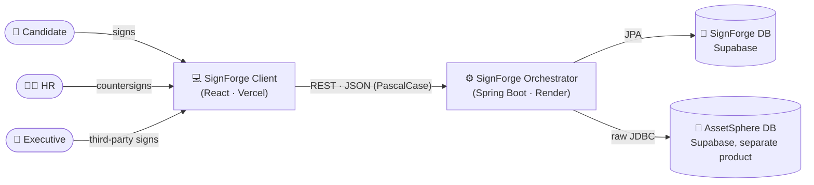

<div align="center">

# 🖋️ SignForge

**An internal multi-party eSignature & offer-letter workflow platform.**

HR creates an Employment Offer 📝 → the Candidate reviews and signs it ✍️ → HR applies a Countersign 🖊️ → an Executive applies the Third-Party Sign where required 🏢 → the offer is **Fully Executed** ✅

<p>
  
  
  
  
</p>
<p>
  
  
  
  
</p>
<p>
  
  
  
  
</p>

</div>

---

## 📦 Monorepo Layout

| Package 📁 | Language | Purpose | Docs |
|---|---|---|---|
| [`SignForgeClientServiceLayerMSC`](./SignForgeClientServiceLayerMSC) 💻 | React 19 + TypeScript | Candidate/HR-facing web app | [README](./SignForgeClientServiceLayerMSC/README.md) |
| [`SignForgeOrchestratorServiceLayerMSC`](./SignForgeOrchestratorServiceLayerMSC) ⚙️ | Java 21 + Spring Boot | Auth, offers, signatures, dashboard API | [README](./SignForgeOrchestratorServiceLayerMSC/README.md) |
| [`SignForgeRunnerScriptsNMSC`](./SignForgeRunnerScriptsNMSC) 🐍 | Python | Dev tooling — JDK discovery, backend env switching | — |
| [`SignForgeAgentDocumentationNMCS`](./SignForgeAgentDocumentationNMCS) 📚 | Markdown | Domain glossary, ADRs, deployment docs | [PROJECT_CONTEXT.md](./SignForgeAgentDocumentationNMCS/PROJECT_CONTEXT.md) |

Everything is tied together with **Bun** 🥟 workspaces and **Turborepo** 🏎️, giving one command surface across three different languages.

## 🚀 Quickstart

**Prerequisites:** [Bun](https://bun.sh) 🥟 · ☕ JDK 21 · 🐍 Python 3

```bash
bun install
bun run dev
```

That single command starts the client and orchestrator together via Turborepo. Useful variants:

```bash
bun run client:dev      # 💻 frontend only
bun run server:dev      # ⚙️ backend only
bun run backend:local   # 🏠 point the client at a local backend
bun run backend:live    # ☁️ point the client at the deployed backend
bun run list:cmd        # 📋 list every available command
```

## 🏗️ How It Fits Together



The Orchestrator reads reference data (departments, designations, work locations) directly from a **sibling product's** database, AssetSphere — a deliberate, documented trade-off. See the ADRs below for why. 👇

## 📖 Documentation

Everything a future contributor (human 🧑‍💻 or agent 🤖) needs to understand *why* this codebase looks the way it does lives in [`SignForgeAgentDocumentationNMCS/`](./SignForgeAgentDocumentationNMCS):

- 📘 [**PROJECT_CONTEXT.md**](./SignForgeAgentDocumentationNMCS/PROJECT_CONTEXT.md) — the domain glossary (Employment Offer, Countersign, Third-Party Sign, and friends)
- 📐 [**ArchitecturalDecisionRecord/**](./SignForgeAgentDocumentationNMCS/ArchitecturalDecisionRecord) — why the non-obvious decisions were made, including:
  - 🔗 Direct AssetSphere database coupling
  - ⚖️ Asymmetric DataSource failure policy
  - 🧬 The 1:1 AssetSphere fidelity mandate that shapes the coding standards
  - 🔑 Committed secret defaults (known, accepted risk)
  - 🗄️ Schema management via Hibernate auto-DDL (no migration tool, yet)
  - 📎 Duplicated agent rule files across services
- 🚢 [**RENDER_BACKEND_DEPLOY_DETAILS.md**](./SignForgeAgentDocumentationNMCS/RENDER_BACKEND_DEPLOY_DETAILS.md) — full backend deployment reference

## 🧭 Coding Standards

Both the client and orchestrator follow a shared **MSC (Model-Service-Controller)** architecture and, deliberately, mirror the coding standards and design system of a sibling internal product, **AssetSphere** — see [`ASSETSPHERE_1TO1_FIDELITY_MANDATE.md`](./SignForgeAgentDocumentationNMCS/ArchitecturalDecisionRecord/ASSETSPHERE_1TO1_FIDELITY_MANDATE.md) for why. Each service folder carries its own `.agents/rules/` for AI coding agents working scoped to just that package.

## ☁️ Deployment

| Layer | Platform | URL |
|---|---|---|
| 💻 Client | ▲ Vercel | `signforge-weplm.vercel.app` |
| ⚙️ Orchestrator | 🎨 Render | `signforgeappcodebasearchitecture.onrender.com` |
| 🐘 Database | Supabase | PostgreSQL 17 |

---

<div align="center">

Made with 🖋️ by the SignForge team.

</div>
